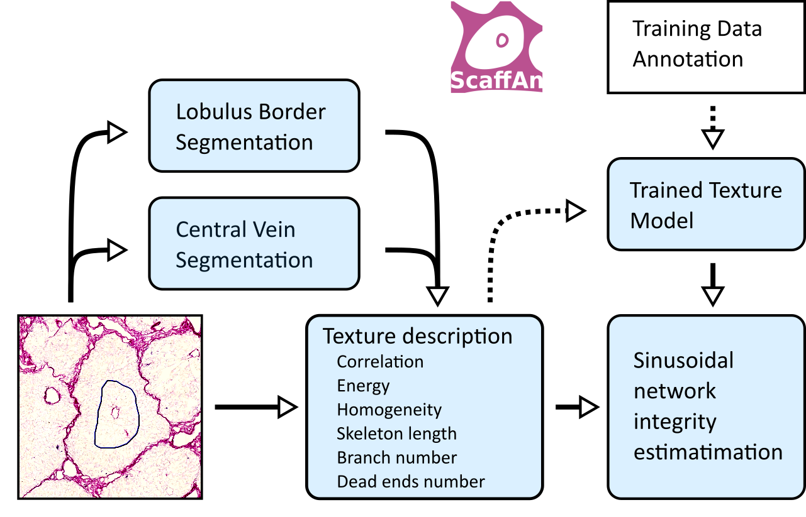
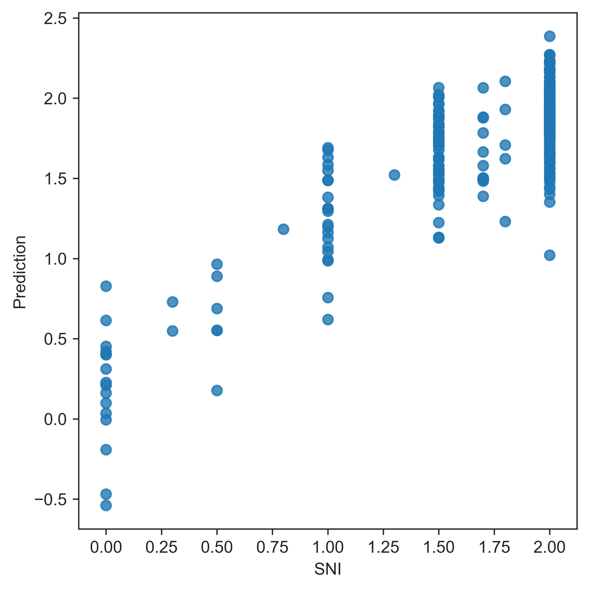

# Scaffan

Main goal of application Scaffan is quantitative description of scaffold based on
image slice.

The algorithm can be separated into two steps. First step is lobulus segmentation. 
In this step the region of segmentation. Based on user interactivity the rough 
localization of examined lobulus is known. This information is used as initial 
step for iterative segmentation algortihm based on Active Contours without Edges 
described in [Snakes](#snakes) and [Neila](#neila). Output of this process is delineation
lobulus boundary and central vein. 

Second step is lobulus area description. Input of this process is the lobulus area. 
Texture in this area is described with several methods. The Gray Level Cooccurence Matrix texture features 
described in [Haralick](#haralick) were used as main texture features. 
Based on this texture features the Sinusoid Integrity can be estimated.




## Application

Application Scaffan is open-source software hosted on GitHub and written in (Python)[#python]. 
The packages [Numpy](#numpy), [Scipy](#scipy), [Scikit-image](#sciklimage) are used for 
general image processing. The morphsnakes package ([Neila](#neila) and [Avarez](#avares)) 
are used for segmentation tasks. For machine learning the [Scikit-learn](#sklean) is used.


## Lobulus segmentation

Initial step of lobulus segmentation is user interactivity over the image slice.
User is expected to draw closed curve around the central vein of examined lobulus.
This curve is used in several moments of processing. 

At first, the input image is 
cropped around input curve with margin size defined by Annotation Margin parameter 
(default vaule is 180%).
The image area should be big enough to cover whole area of lobulus. 
The resolution of image is changed to 1.82um. It is enough to keep all important 
structures visible and also keep the computation time low. 

The preprocessing step of lobulus segmentation is to use Hessian based Frangi 
filter [Frangi](#frangi), [Kroon](#kroon) to supress the high-frequency signal 
in lobulus area and to make the lobulus border more dominant. Then a method 
Morphological Active Contours without Edges described in [Casselles](#casselles), 
[Neila](#neila) and [Avarez](#avarez) is used to extract outer boundary of liver
lobulus. 

Due to lower contrast the segmentation of Central Vein is more complex task. 
We use the texture analysis to detect roughly the area of Central Vein. 
Gradient magnitude filtration using Gaussian derivatives combined with the 
Frangi filter is used to have more details of the shape of Central Vein.

## Lobulus analysis

To describe texture properties in the Gray Level Cooccurence Matrix texture features 
described in [Haralick](#haralick) and [Texture Analysis](#texture-analysis) 
Additionally the manually crafted features were used. 


## Segmentation evaluation

To evaluate lobulus area segmentation the manual annotation of data was performed.
Our semi-automatic segmentation method was compared with manual segmentation of lobulus border and central vein. 
The Jaccard simmilarity coefficient (also known as Intersection over Union) 
( [Jaccard](#jaccard) and [Levandowsky](#levandowsky) ) was used to measure similarity between samples. 


Lobulus border and central vein segmentation evaluation by Jaccard Index.
Whiskers proportionaly extends low and high quartiles by 1.5 of the interquartile range (IQR). Points outside this range are be identified as outliers.


## Sinusoid ingegrity evaluation


Reference-style: 



## Annotation 

Geometric annotation is done with Freehand Region tool. We use fallowing color code:

* blue - PV selection
* green - PV selection with additional black annotation of portal vein and lobulus
* black - Additional annotation of portal vein and lobulus border
* magenta - training data for empty space
* red - training area for septum

Written in Annotation Details field

* `SNI`: Sinusoidal Integrity <0,2>
* `SQZ`: Squeeze 0-no squeeze, 1-squeezed (maybe different types? anisotropic(getting suqeezed), isotropic (getting small))
* `CMP`: Compactness <0,1>
* `IFE`: Image Focus Error <0,1>
* `AIS`: Anisotropy <0,1> 0 for random orientation, 1 for big directionality
* `CVM`: Central Vein Missing, 0 Central Vein is in the image, 1 - Central Vein is not in the image
* `ICE`: Image Contrast Error <0,1>, 0 - image contrast is ok, 1 - image contrast is low
* `SCE`: Slice Contamination Error <0,1> 

texture problem - local / global

## User interface

Scaffan work with image data in `.ndpi` format and `.ndpa` annotation . This annotation can be prepared in Hamamatsu 
NDP.view 2 application. Scaffan require to annotate each lobulus by closed curve around central vein.

# References:

## Frangi
A. Frangi, W. Niessen, K. Vincken, and M. Viergever. “Multiscale vessel enhancement filtering,” In LNCS, vol. 1496, pages 130-137, Germany, 1998. Springer-Verlag

## Kroon
Kroon, D.J.: Hessian based Frangi vesselness filter.


## Neila
A Morphological Approach to Curvature-based Evolution of Curves and Surfaces, Pablo Márquez-Neila, Luis Baumela and Luis Álvarez. In IEEE Transactions on Pattern Analysis and Machine Intelligence (PAMI), 2014, DOI 10.1109/TPAMI.2013.106

## Alvarez
Morphological Snakes. Luis Álvarez, Luis Baumela, Pablo Márquez-Neila. In Proceedings of the IEEE Conference on Computer Vision and Pattern Recognition 2010 (CVPR10).

## Casselles
Geodesic Active Contours, Vicent Caselles, Ron Kimmel and Guillermo Sapiro. In International Journal of Computer Vision (IJCV), 1997, DOI:10.1023/A:1007979827043

## Chan
Active Contours without Edges, Tony Chan and Luminita Vese. In IEEE Transactions on Image Processing, 2001, DOI:10.1109/83.902291

## Python

```
@book{van1995python, 
  title={Python tutorial}, 
  author={Van Rossum, Guido and Drake Jr, Fred L}, 
  year={1995}, 
  publisher={Centrum voor Wiskunde en Informatica Amsterdam, The Netherlands} 
}
```

## Numpy
```
@book{book,
author = {Oliphant, Travis},
year = {2006},
month = {01},
pages = {},
title = {Guide to NumPy}
}
```
## Scipy

```
@Misc{, 
  author =    {Eric Jones and Travis Oliphant and Pearu Peterson and others}, 
  title =     {{SciPy} : Open source scientific tools for {Python}}, 
  year =      {2001--}, 
  url = "http://www.scipy.org/", 
  note = {[Online; accessed ]} 
}
```

## Scikimage
```
@article{van2014scikit, 
  title={scikit-image: image processing in Python}, 
  author={Van der Walt, Stefan and Sch{\"o}nberger, Johannes L and Nunez-Iglesias, Juan and Boulogne, Fran{\c{c}}ois and Warner, Joshua D and Yager, Neil and Gouillart, Emmanuelle and Yu, Tony}, 
  journal={PeerJ}, 
  volume={2}, 
  pages={e453}, 
  year={2014}, 
  publisher={PeerJ Inc.} 
}
```

## Sciklearn

```
@article{scikit-learn,
 title={Scikit-learn: Machine Learning in {P}ython},
 author={Pedregosa, F. and Varoquaux, G. and Gramfort, A. and Michel, V.
         and Thirion, B. and Grisel, O. and Blondel, M. and Prettenhofer, P.
         and Weiss, R. and Dubourg, V. and Vanderplas, J. and Passos, A. and
         Cournapeau, D. and Brucher, M. and Perrot, M. and Duchesnay, E.},
 journal={Journal of Machine Learning Research},
 volume={12},
 pages={2825--2830},
 year={2011}
}
```

## Sklearn API

```
@inproceedings{sklearn_api,
  author    = {Lars Buitinck and Gilles Louppe and Mathieu Blondel and
               Fabian Pedregosa and Andreas Mueller and Olivier Grisel and
               Vlad Niculae and Peter Prettenhofer and Alexandre Gramfort
               and Jaques Grobler and Robert Layton and Jake VanderPlas and
               Arnaud Joly and Brian Holt and Ga{\"{e}}l Varoquaux},
  title     = {{API} design for machine learning software: experiences from the scikit-learn
               project},
  booktitle = {ECML PKDD Workshop: Languages for Data Mining and Machine Learning},
  year      = {2013},
  pages = {108--122},
}
```

## Jaccard

https://nph.onlinelibrary.wiley.com/doi/abs/10.1111/j.1469-8137.1912.tb05611.x

## Levandowsky

Levandowsky, Michael; Winter, David (1971), "Distance between sets", Nature, 234 (5): 34–35

https://www.nature.com/articles/234034a0

## Texture Analysis

Tuceryan, M., & Jain, A. K. (1998). Texture Analysis. In The Handbook of Pattern Recognition and Computer Vision (2nd Edition). Retrieved from http://citeseerx.ist.psu.edu/viewdoc/summary?doi=10.1.1.38.5980

## Haralick

Haralick, R.M., “Statistical and Structural Approaches to Texture,” Proceedings ofthe IEEE, 67, pp. 786-804, 1979.


## Snakes

Snakes: Active contour models (1988)
by Michael Kass , Andrew Witkin , Demetri Terzopoulos
Venue:	INTERNATIONAL JOURNAL OF COMPUTER VISION
Citations:	3874 - 17 self

https://citeseerx.ist.psu.edu/viewdoc/summary?doi=10.1.1.124.5318
